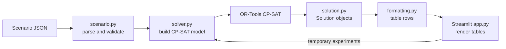
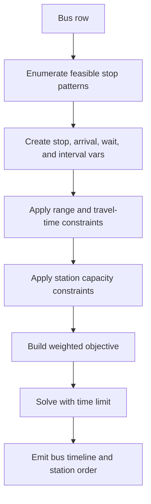

# Architecture

## System overview

This is a single-process Python + Streamlit app. The UI loads one scenario, the scheduler builds a CP-SAT model from that scenario, OR-Tools solves it, and the app renders the resulting bus timelines and station queues.

The design is intentionally data-driven:
- `data/scenarios/scenario_*.json` defines the route, stations, buses, parameters, and weights.
- `scheduler/scenario.py` validates and loads that data into typed dataclasses.
- `scheduler/solver.py` turns the data into a CP-SAT optimization model.
- `scheduler/solution_model.py` holds the solver output.
- `scheduler/formatting.py` converts the output into table rows for Streamlit.
- `app.py` wires the scenario selector, weight sliders, solver, and tables together.

## Runtime flow



The JSON file is the source of truth for committed behavior. The Streamlit sliders are for interactive exploration, but scenario weights are what should be stored when a behavior change is meant to persist.

## Scheduler approach

The scheduler uses CP-SAT because this problem is a mix of hard constraints and weighted tradeoffs:
- each bus must respect battery range between charges,
- each station has only a limited number of chargers,
- each stop has a fixed charge duration,
- and the objective balances individual wait time, operator fairness, and overall completion time.

CP-SAT fits well because the schedule is discrete, constraint-heavy, and small enough to model directly without building a custom heuristic. It also gives a best feasible answer within a time limit, which is useful when the fleet grows or when the model is extended.

### Solver flow



The key modeling choice is pattern enumeration per bus. For each bus, the solver generates all station-stop combinations that keep every leg within battery range. It then uses one boolean choice per feasible pattern, which keeps the model readable and makes the range rule explicit instead of implicit.

At each station, the model creates:
- `arrival`, `start`, `end`, `depart`, and `wait` integer variables,
- an optional charge interval,
- and a stop boolean that controls whether the bus charges there.

Station capacity is enforced with:
- `AddNoOverlap` when there is one charger,
- `AddCumulative` when a station has multiple chargers.

## Data structure design

The scenario schema is designed to keep the solver generic while still being strict about the route shape.

| Concept | Where it lives | Purpose |
| --- | --- | --- |
| Weights | `weights` in scenario JSON -> `Weights` | Tune the objective per scenario |
| Operating parameters | `parameters` in scenario JSON -> `Parameters` | Define speed, battery range, charge duration, and charger count |
| Route | `route` -> `RouteSegment` | Define the contiguous path and distances |
| Stations | `stations` -> `List[str]` | Identify charging stops on the route |
| Buses | `buses` -> `Bus` | Define demand, operator, direction, and departure time |
| Solver output | `Solution`, `TimelineEvent`, `StationCharge` | Store the solved schedule for rendering |

### Scenario model

`scheduler/scenario.py` validates the input before the solver sees it. That matters because the solver assumes:
- the route is contiguous,
- stations are exactly the intermediate route nodes,
- bus origin and destination are the route endpoints,
- and times are stored as minute offsets.

```python
@dataclass(frozen=True)
class Weights:
    individual: float
    operator: float
    overall: float


@dataclass(frozen=True)
class Parameters:
    speed_kmph: int
    battery_range_km: int
    charge_minutes: int
    chargers_per_station: int


@dataclass(frozen=True)
class RouteSegment:
    start: str
    end: str
    distance_km: int


@dataclass(frozen=True)
class Bus:
    bus_id: str
    operator: str
    origin: str
    destination: str
    depart_time: str
    depart_minute: int
```

### Output model

The solver returns structured events instead of formatted text so the UI can render or reformat them later without touching the optimization layer.

```python
@dataclass(frozen=True)
class TimelineEvent:
    bus_id: str
    operator: str
    event_type: str
    start_minute: int
    end_minute: int
    station: Optional[str]


@dataclass(frozen=True)
class StationCharge:
    station: str
    bus_id: str
    operator: str
    start_minute: int
    end_minute: int
```

## Why this structure is a good fit

1. **It keeps route logic data-driven.** Distances, stations, and direction all come from scenario data, so changing a scenario does not require rewriting solver logic.
2. **It isolates policy from presentation.** The CP-SAT model lives in `solver.py`; formatting lives in `formatting.py`; Streamlit only renders the results.
3. **It supports validation before optimization.** Bad inputs fail early in `scenario.py`, which prevents cryptic solver errors.
4. **It keeps the objective tunable.** The weights are separate from the constraints, so balancing wait time vs fairness vs makespan is a data change, not a structural rewrite.

## Future changes anticipated in the data structure

These are the kinds of changes the schema was designed to absorb without code changes:

| Future change | How the current design handles it |
| --- | --- |
| New scenario variants | Add another `scenario_*.json` file with the same schema |
| Different weight tuning | Change `weights` in the scenario file |
| More or fewer buses | Add or remove rows in `buses` |
| New operators | Add buses with the new operator name; the solver groups operators dynamically |
| Different departure schedules | Change `depart_time` values in `buses` |
| Reverse direction service | Swap `origin` and `destination`; `_ordered_stations()` reverses the station order automatically |
| Different route distances | Edit the `route` list; travel times are recomputed from distances |
| More or fewer charging stations | Edit `stations`; validation keeps stations aligned with the route interior |
| Different charger capacity | Change `chargers_per_station`; the solver switches between `AddNoOverlap` and `AddCumulative` |
| Different driving or charging assumptions | Change `speed_kmph`, `battery_range_km`, or `charge_minutes` in `parameters` |
| Priority buses | Add a bus attribute and weight it in the objective or add a hard ordering constraint |
| Time-of-day electricity cost | Add a time-dependent cost field and include it in the objective per charge interval |
| Driver shifts | Add shift windows to bus or operator data and constrain the relevant intervals |
| Multiple routes sharing stations | Add a route identifier and group station capacity by shared station key instead of route name |

The important idea is that common operational changes stay in data. That lets the same code support all five scenarios and future scenario variants without branching the solver by scenario ID.

## How to change a weight

Change the scenario JSON. Scenario 4 already uses a higher operator weight:

```json
{
  "scenario_id": "scenario_4",
  "weights": { "individual": 1.0, "operator": 2.0, "overall": 1.0 }
}
```

That weight is loaded by `scheduler/scenario.py`, passed to `solve_schedule()`, and scaled into the CP-SAT objective in `scheduler/solver.py`.

If you want to experiment temporarily in the UI, the Streamlit sliders in `app.py` override the scenario values for that run only.

## How to add a new rule

If the rule is a real scheduling constraint, add it in the solver and expose it through the scenario schema when it should be tunable.

Example: cap waiting time at a station to 30 minutes.

### 1) Add the parameter to the scenario data

```json
{
  "parameters": {
    "speed_kmph": 60,
    "battery_range_km": 240,
    "charge_minutes": 25,
    "chargers_per_station": 1,
    "max_wait_minutes": 30
  }
}
```

### 2) Carry the parameter through the dataclass

```python
@dataclass(frozen=True)
class Parameters:
    speed_kmph: int
    battery_range_km: int
    charge_minutes: int
    chargers_per_station: int
    max_wait_minutes: int | None = None
```

### 3) Enforce it in the solver

Inside the per-station loop, add the constraint only when the bus actually stops:

```python
max_wait_minutes = scenario.parameters.max_wait_minutes
if max_wait_minutes is not None:
    model.Add(wait <= max_wait_minutes).OnlyEnforceIf(stop)
```

That keeps the rule reusable across scenarios instead of hardcoding it for a single case. If a future rule only affects one scenario, it should still be added as a parameter first so the solver stays generic.

## Assumptions

- Scenario files are the single source of truth for weights and operational parameters.
- The route is contiguous and runs between the same two endpoints in each scenario.
- Buses only travel in one direction per run and never backtrack.
- Charging always takes a fixed amount of time and always fills the battery.
- The solver is expected to return the best feasible schedule within the configured time limit when optimality is not proven.
